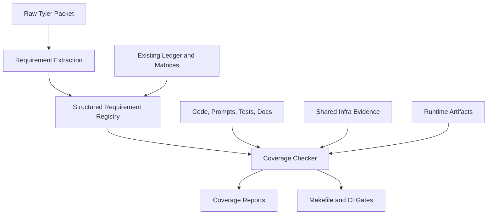
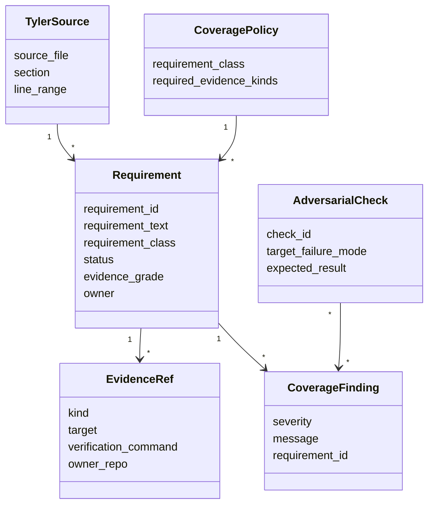
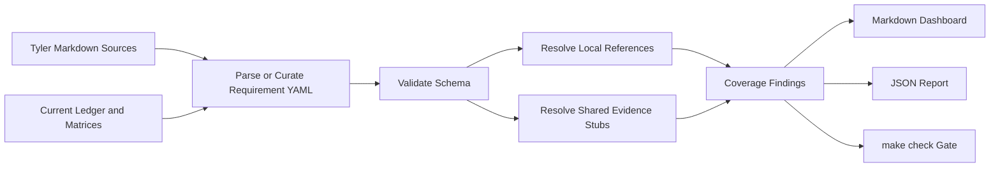

# Tyler Requirements Traceability Program

> Sources consulted: `CLAUDE.md`; `README.md`;
> `docs/MAINTAINER_START_HERE.md`; `docs/PLAN.md`;
> `docs/CONCERNS.md`; `docs/TYLER_REQUIREMENTS_COVERAGE_STATUS.md`;
> `docs/TYLER_AUDIT_QUALITY_STANDARD.md`;
> `docs/TYLER_TRACEABILITY.md`; `docs/TYLER_SPEC_GAP_LEDGER.md`;
> `docs/TYLER_EXECUTION_STATUS.md`;
> `docs/TYLER_FULL_SPEC_AUDIT_MATRIX.md`;
> `docs/TYLER_SYSTEMATIC_REVIEW_MATRIX.md`;
> `docs/TYLER_V1_CURRENT_REPO_MAP.md`;
> `docs/plans/CLAUDE.md`;
> `docs/plans/maintainer_onboarding_cleanup_wave1.md`;
> raw Tyler packet in ignored local directory `2026_0325_tyler_feedback/`.
>
> Status: active planning document. This supersedes PR-readiness framing for
> the current branch.

## Mission

Build a durable Tyler requirements coverage system that lets a maintainer ask:

- What exactly did Tyler require?
- Where is each requirement implemented?
- What test, artifact, prompt, doc, or shared-infra proof closes it?
- Which requirements are ambiguous, extension-only, watch items, or still gaps?
- Which active docs disagree with the ledger?

This plan is about requirements traceability and maintainer success. It is not
about preparing a PR as the near-term goal.

## Modality Diagnosis

This is hybrid work.

Deductive:

- The raw Tyler source files are known.
- The existing audit rows have stable IDs.
- Coverage evidence can be represented as structured records.
- Link validity, file existence, test-symbol existence, and doc drift can be
  checked programmatically.

Exploratory:

- The exact evidence policy per requirement class should be calibrated from the
  current ledger before being made strict.
- Shared-infra rows need repo-specific readouts from `llm_client`,
  `open_web_retrieval`, `prompt_eval`, and future `trace_eval`.
- Social-media MCP discovery may be useful for future source discovery, but
  should remain outside Tyler core until a typed adapter and quality readout are
  designed.

## Design Frame

### Requirements

The traceability system must:

1. Preserve Tyler's raw requirements as the top authority.
2. Represent every audited Tyler requirement as structured data.
3. Link every requirement to local code, prompts, docs, tests, runtime artifacts,
   and shared-infra evidence where applicable.
4. Distinguish local test coverage from shared-infra or runtime-artifact
   evidence.
5. Grade evidence strength instead of treating closure as a binary flag.
6. Fail loudly when a closed row lacks its declared evidence kind.
7. Include negative controls that prove the checker catches false closure.
8. Surface stale or contradictory active docs.
9. Produce human-readable and agent-readable reports.

### Boundaries

Inside this repo:

- structured requirement registry
- report generator
- local reference and evidence checker
- active-doc drift checker
- maintainer docs and plan index

Outside this repo:

- shared runtime/model evidence from `llm_client`
- provider adapter evidence from `open_web_retrieval`
- prompt/model comparison evidence from `prompt_eval`
- future runtime trace evidence from `trace_eval`
- social-media MCP discovery as an optional future source-discovery input

### Domain Model

### Data Flow

## Acceptance Criteria

- Raw Tyler source provenance is reproducible from tracked files or an explicit
  documented exception.
- A structured registry exists for Tyler requirements and evidence rows.
- Existing Markdown reports are generated from structured data or checked
  against it for drift.
- Every closed requirement row declares and satisfies required evidence kinds.
- Every non-context row has a line-level Tyler source anchor or an explicit
  documented reason a line anchor is impossible.
- Every closed row has an evidence grade from the quality standard.
- The checker includes negative-control fixtures for false closure cases.
- The checker catches missing files, missing test refs, missing shared-infra
  owners, missing line anchors, and closed rows without required evidence.
- `make tyler-coverage-json` emits a stable JSON contract.
- `make tyler-coverage` emits a maintainer-readable dashboard.
- `make check` includes the strict coverage gate once calibrated.
- Active docs that contradict the ledger are reconciled or explicitly marked
  stale/superseded.

## Audit Quality Standard

The governing quality bar is
`docs/TYLER_AUDIT_QUALITY_STANDARD.md`. Implementation must follow that
standard rather than simply encoding the current Markdown table shape.

Minimum required upgrades:

- line-level Tyler source anchors;
- two-pass requirement extraction and classification;
- evidence grades `A` through `F`;
- requirement-class evidence policy;
- adversarial audit lane for every closure slice;
- negative-control checker fixtures;
- fresh-code verification for current source, not historical fix notes alone;
- reproducibility fields for runtime artifacts.

Strong closure means the evidence grade licenses the claim. For example, a
runtime behavior row needs local behavioral proof or a runtime artifact readout;
doc-only evidence may document ambiguity or extension status, but it cannot
close runtime behavior.

## Failure Modes

| Failure | Diagnostic | Response |
|---|---|---|
| Markdown remains the hidden source of truth | Registry is generated by scraping tables only | Promote to YAML/JSON source or define a one-way generation/check policy |
| Link validity mistaken for requirement coverage | Checker only reports broken refs | Add evidence-kind policy and fail closed rows without required proof |
| Binary closure hides weak proof | Rows marked `verified_fixed` without evidence grade | Add evidence grades and display `F` rows first |
| Broad source section hides requirement ambiguity | Row cites a file or stage but no line span | Require line-level Tyler anchors or explicit exception |
| Shared-infra proof treated as local pytest proof | Requirement row cites external repo without owner/command | Require `owner_repo` and `verification_command` on shared evidence |
| Checker is untested against bad data | Only happy-path current docs are parsed | Add negative-control fixtures that must fail |
| Raw Tyler packet missing from clone | `2026_0325_tyler_feedback/` remains ignored with no tracked copy | Track a sanitized source copy or document the exception and derived artifact hash |
| Active docs conflict silently | Status/map docs make different closure claims | Add doc-drift audit and reconcile canonical docs |
| MCP discovery bypasses Tyler evidence contracts | Social/search sources feed synthesis directly | Keep MCP behind typed provider adapter and existing evidence gates |

## Slice Roadmap

### Slice 1: Freeze Current Requirements State

Advances: make the current state explicit and stop PR-readiness drift.

Vertical scope:

- Add `docs/TYLER_REQUIREMENTS_COVERAGE_STATUS.md`.
- Add this active plan.
- Update plan index and concern register.

Success:

- Maintainer docs answer Tyler-source, test-coverage, audit, LOC, and doc-count
  questions without relying on conversation memory.

Audit:

- Check that the new docs do not claim every Tyler requirement has local pytest
  coverage.
- Check that the docs name the raw Tyler packet reproducibility gap.

Cleanup:

- Ensure the plan index names this plan as active and does not frame the next
  step as PR readiness.

Status: complete.

### Slice 2: Structured Registry Skeleton

Advances: convert the current read model into governed data with audit-quality
fields from `docs/TYLER_AUDIT_QUALITY_STANDARD.md`.

Vertical scope:

- Add a schema for requirement rows and evidence refs.
- Include source line anchors, requirement class, evidence grade, adversarial
  notes, and expected evidence kinds.
- Seed it from the 36 current ledger rows.
- Keep generated Markdown identical enough for review.

Success:

- `make tyler-coverage-json` emits structured rows with evidence kinds.
- All seeded rows either have line-level anchors or explicit `anchor_pending`
  status.
- Existing `make tyler-traceability-json` still passes.

Audit:

- Compare generated row IDs and statuses against the current ledger.
- Verify no current row disappears.
- Sample at least five rows and confirm the evidence grade is not stronger than
  the evidence warrants.

Cleanup:

- Decide whether Markdown is generated from registry or registry is checked
  against Markdown. Record the decision in the plan.

Status: partial. `scripts/check_tyler_coverage.py` now builds a non-strict
structured read model from the current ledger and exposes `make
tyler-coverage` / `make tyler-coverage-json`. It deliberately remains a read
model over Markdown until source-anchor backfill and negative controls are in
place.

First readout:

- 36 requirements
- 0 rows pending line-level Tyler anchors or explicit exceptions
- 31 rows with line-level Tyler anchors
- 5 rows with explicit doc-governance anchor exceptions
- evidence grades: 21 `A`, 2 `B`, 1 `C`, 12 `D`, 0 `F`
- grade-F rows: none

Update from the anchor pass: `S2-QUERY-MODEL-001` and
`S2-QUERY-VARIANTS-001` are no longer treated as audit-evidence-only gaps. The
raw Tyler packet describes Stage 2 query generation as string/orchestrator
templates; the live runtime previously used a model-driven
query-diversification prompt. These rows required a runtime decision before
closure and are now fixed by the deterministic template path below.

Second anchor-pass update: high-priority Stage 1, Stage 2, Stage 3, Stage 4,
Stage 5, Stage 6, ambiguity, schema, extension, frontier-watch, and
provider-control rows now cite line-level Tyler packet anchors where the packet
provides concrete text. Five local documentation-status rows are marked with
explicit doc-governance anchor exceptions because they govern active repo-doc
truthfulness against the ledger rather than standalone Tyler requirements.

Runtime decision on 2026-06-25: restore the Tyler-literal orchestrator
template path. Rationale: `CLAUDE.md` defines Tyler literal compliance as the
priority, the raw Build Plan and Prompt packet both explicitly say Stage 2
query generation is string/template orchestration rather than a model call, and
no local evidence currently licenses a model-driven query-generation extension.
The implementation slice removed the live `query_diversification` model call,
generates at most four query plans per sub-question from deterministic
templates, keeps high-priority Exa routing as the already-audited provider
extension/control path, and updates tests so the runtime cannot silently
reintroduce an LLM call.

Acceptance for this runtime slice:

- `generate_search_queries_tyler_v1()` imports neither `render_prompt` nor
  `acall_llm_structured`.
- Query plans use Tyler's template families with hard cap
  `MAX_QUERIES_PER_SUB_QUESTION = 4`.
- High-priority sub-questions still exercise both Tavily and Exa, but query
  text is produced by deterministic templates.
- Runtime tests fail if an LLM-backed query-diversification call is made.
- Active docs and config no longer describe `query_diversification` as a
  Tyler-literal model assignment.

Status: complete. Verified with targeted Stage 2 tests, `make
tyler-coverage-json`, `scripts/check_tyler_traceability.py --format json
--fail-on-issues`, and `make check`.

### Slice 3: Evidence Policy Gate

Advances: turn traceability from a link checker into a coverage checker.

Vertical scope:

- Define required evidence kinds by requirement class.
- Fail rows marked `verified_fixed` if required evidence is missing.
- Allow explicit exceptions for doc-only, ambiguity, extension, watch, and
  shared-infra rows.
- Add negative-control fixtures that prove the gate catches false closures.

Success:

- The current known exceptions are represented explicitly, not hidden in prose.
- Negative controls fail for the expected reason.
- `make check` runs the calibrated gate.

Audit:

- Confirm `S3-MODEL-VERSION-001`, `S2-TAVILY-DEPTH-001`, and `DOC-README-001`
  are classified intentionally.
- Confirm a runtime row cannot pass with doc-only evidence.

Cleanup:

- Remove any ad hoc parsing rules made obsolete by the structured schema.

Status: complete for the grade-F evidence gate. Negative-control fixture tests
now exist for the seven failure families in
`docs/TYLER_AUDIT_QUALITY_STANDARD.md`: runtime doc-only closure, schema row
without model test, prompt row with broken render ref, shared-infra row without
explicit owner, runtime-artifact row without artifact path, Tyler source row
without line anchor, and stale-doc row without doc ref. `make check` now runs
`scripts/check_tyler_coverage.py --fail-on-grade-f`, while line-anchor gaps
remain intentionally non-strict until the source-anchor backfill is complete.

### Slice 4: Active Doc Drift Audit

Advances: remove contradictory guidance from the maintainer surface.

Vertical scope:

- Programmatically scan active docs for known stale Tyler status claims.
- Reconcile `docs/TYLER_V1_CURRENT_REPO_MAP.md` with the newer ledger/status
  docs or mark it superseded.
- Add a doc-audit command.

Success:

- No active doc claims open local Tyler gaps that the ledger says are closed
  unless it explicitly cites a current row.

Audit:

- Review the authority chain in `docs/MAINTAINER_START_HERE.md`,
  `docs/plans/CLAUDE.md`, and `CLAUDE.md`.

Cleanup:

- Move or mark stale docs instead of leaving contradictory prose in place.

### Slice 5: Fresh Codebase Audit

Advances: prove coverage against live code, not only historical audit docs.

Vertical scope:

- Use graph/code search plus deterministic scans to map requirement rows to
  current functions, prompts, tests, and runtime artifact writers.
- Record findings in the structured registry.
- Assign or revise evidence grades based on current-code proof.

Success:

- Every non-doc requirement has current local source refs or an explicit
  shared-infra/runtime-artifact justification.
- Historical fix notes are retained only as provenance, not sole closure proof.

Audit:

- Sample high-risk Stage 2, Stage 3, Stage 5, and Stage 6 rows manually.
- Try to falsify at least one grade `A` row per high-risk stage.

Cleanup:

- Remove dead references discovered by the scan.

### Slice 6: Independent Closure Review

Advances: calibrate the programmatic checker against adversarial human/agent
judgment before any readiness claim.

Vertical scope:

- Run the adversarial audit lane from `docs/TYLER_AUDIT_QUALITY_STANDARD.md`.
- Review all grade `C`, `D`, and `F` rows.
- Sample grade `A` and `B` rows across Stage 2, Stage 3, Stage 5, and Stage 6.

Success:

- Every adversarial finding is dispositioned in the registry or concern
  register.
- No row with grade `F` is described as closed.

Audit:

- Check for tests that assert implementation details without asserting Tyler
  behavior.
- Check for shared-infra rows without owner repo and verification command.

Cleanup:

- Update docs generated from the registry and remove stale closure prose.

## Current Concern Register Additions

- Raw Tyler packet is ignored, making full audit reproduction clone-dependent.
- Current checker validates references, not evidence sufficiency.
- Binary `verified_fixed` status can overstate closure strength unless paired
  with evidence grade and class policy.
- Active docs may still conflict about remaining Tyler-required items.
- Shared-infra evidence is not yet governed with owner repo and verification
  command fields.
- Social-media MCP is useful for future current-source discovery, but not yet a
  Tyler runtime dependency.
